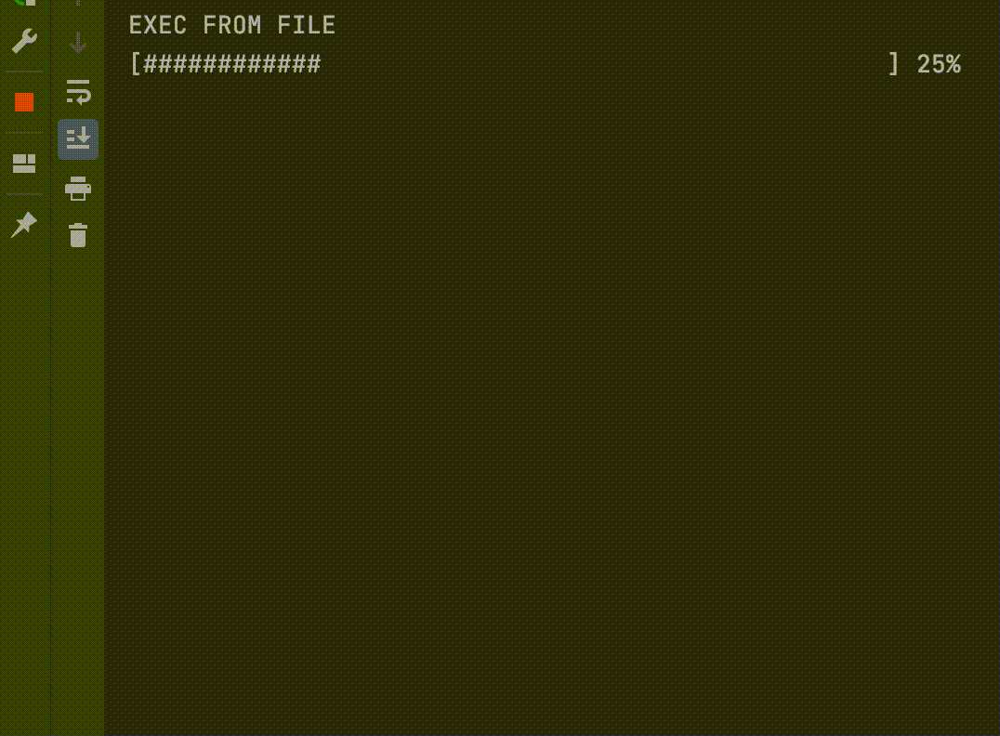

# CPP Texas Solver

[](https://github.com/bupticybee/TexasSolver/releases)
[](https://github.com/bupticybee/TexasSolver/blob/master/LICENSE)
[](https://colab.research.google.com/github/bupticybee/TexasSolver/blob/master/TexasSolverTechDemo.ipynb)

README [English](README.md) | [中文](README.zh-CN.md)

## Introduction 
A open sourced, extremely efficient Texas Hold'em and short deck solver. See this [Introduction video](https://www.youtube.com/watch?v=MydczBwSfWc) for more.

Features:
- In a tree with 1~2bets + allin, it's speed exceeds piosolver on flop
- Support Mac, Linux and Windows
- Support texas holdem and shortdeck
- Support cross language calls
- Result aliged with piosolver
- Support dump strategy to json file
- It's the c++ version of [TexasHoldemSolverJava](https://github.com/bupticybee/TexasHoldemSolverJava) with a ton of optimization, it's 5x faster than the jave version and takes less than 1/3 memory.

Feel free to mess with a toy solver [in google colab](https://colab.research.google.com/github/bupticybee/TexasSolver/blob/master/TexasSolverTechDemo.ipynb)


## Speed benchmark with piosolver

Piosolver and my TexasSolver run use the same settings (spr=10,flop game) and their result are aligned.

|                   | Input config                                            | log                                                                | thread number | memory usage | accuracy | converge time |
| ----------------- | ------------------------------------------------------- | ------------------------------------------------------------------ | ------------- | ------------ | -------- | ------------- |
| piosolver 1.0     | [config_piosolver](benchmark/benchmark_piosolver.txt)   | [log_piosolver](benchmark/benchmark_outputs/piosolver_log.txt)     | 6             | 492Mb        | 0.29%    | 242s          |
| TexasSolver 0.1.0 (Our solver) | [config_texassolver](benchmark/benchmark_texassolver.txt) | [log_texassolver](benchmark/benchmark_outputs/texassolver_log.txt) | 6             | 1600Mb       | 0.275%   | 172s          |

The compare image of their results is  [here](benchmark/benchmark_outputs/result_compair.png). As you can see their result are very close.


## Install

Download the [release package](https://github.com/bupticybee/TexasSolver/releases), unzip it, you will get a folder look like this:

```text
--- Solver
 |- resources
 |- console_solver.exe
```

If you download MacOs version, ```console_solver.exe``` should be replaced by a ```console_solver``` executable file.

Put the folder wherever you like, and the installation is done! It's that simple.

If you are using Linux system or the release didn't work on your computer, you should [Compile the release package](#compile-from-source) first.

## Usage

### command line solver

You can easily call the solver using command line tools from Windows(cmd), Linux(bash), and mac(terminal).

For example, if you are using Windows, enter windows cmd terminal (press windows button, input cmd, press enter), go to the install directory, and you can run an example by a simple command:

```text
console_solver.exe -i resources/text/commandline_sample_input.txt 
```

And MacOs and Linux users should use this command:

```text
./console_solver -i resources/text/commandline_sample_input.txt 
```



You will see something like the following log:

```text
EXEC FROM FILE
[##################################################] 100%
<<<START SOLVING>>>
Using 8 threads
Iter: 0
player 0 exploitability 43.637302
player 1 exploitability 27.916748
Total exploitability 71.55405 precent
-------------------
Iter: 11
player 0 exploitability 15.374577
player 1 exploitability 2.400461
Total exploitability 17.775038 precent
time used: 6.871
-------------------
....
```

and after the solving process is done, a ```output_result.json``` file should be generated. It contains the optimal strategy that was calculated.

The input file, above mentioned ```resources/text/commandline_sample_input.txt``` contains parameters controls the tree building and solving process. A typical such file look like this:

```text
set_pot 50
set_effective_stack 200
set_board Qs,Jh,2h
set_range_ip AA,KK,QQ,JJ,TT,99:0.75,88:0.75,77:0.5,66:0.25,55:0.25,AK,AQs,AQo:0.75,AJs,AJo:0.5,ATs:0.75,A6s:0.25,A5s:0.75,A4s:0.75,A3s:0.5,A2s:0.5,KQs,KQo:0.5,KJs,KTs:0.75,K5s:0.25,K4s:0.25,QJs:0.75,QTs:0.75,Q9s:0.5,JTs:0.75,J9s:0.75,J8s:0.75,T9s:0.75,T8s:0.75,T7s:0.75,98s:0.75,97s:0.75,96s:0.5,87s:0.75,86s:0.5,85s:0.5,76s:0.75,75s:0.5,65s:0.75,64s:0.5,54s:0.75,53s:0.5,43s:0.5
set_range_oop QQ:0.5,JJ:0.75,TT,99,88,77,66,55,44,33,22,AKo:0.25,AQs,AQo:0.75,AJs,AJo:0.75,ATs,ATo:0.75,A9s,A8s,A7s,A6s,A5s,A4s,A3s,A2s,KQ,KJ,KTs,KTo:0.5,K9s,K8s,K7s,K6s,K5s,K4s:0.5,K3s:0.5,K2s:0.5,QJ,QTs,Q9s,Q8s,Q7s,JTs,JTo:0.5,J9s,J8s,T9s,T8s,T7s,98s,97s,96s,87s,86s,76s,75s,65s,64s,54s,53s,43s
set_bet_sizes oop,flop,bet,50
set_bet_sizes oop,flop,raise,60
set_bet_sizes oop,flop,allin
set_bet_sizes ip,flop,bet,50
set_bet_sizes ip,flop,raise,60
set_bet_sizes ip,flop,allin
set_bet_sizes oop,turn,bet,50
set_bet_sizes oop,turn,raise,60
set_bet_sizes oop,turn,allin
set_bet_sizes ip,turn,bet,50
set_bet_sizes ip,turn,raise,60
set_bet_sizes ip,turn,allin
set_bet_sizes oop,river,bet,50
set_bet_sizes oop,river,donk,50
set_bet_sizes oop,river,raise,60,100
set_bet_sizes oop,river,allin
set_bet_sizes ip,river,bet,50
set_bet_sizes ip,river,raise,60,100
set_bet_sizes ip,river,allin
set_allin_threshold 0.67
build_tree
set_thread_num 8
set_accuracy 0.5
set_max_iteration 200
set_print_interval 10
set_use_isomorphism 1
start_solve
set_dump_rounds 2
dump_result output_result.json
```

Modify the file to control the game tree details and parallelism, etc. By default the input file contains a flop situation where game tree is constructed using 1bet/raise+allin in flop and turn, using 2bet/raise+allin in river.

## Reading the Solver's output strategy

Please refer to [This section](https://github.com/bupticybee/TexasHoldemSolverJava#reading-the-solvers-output) in java version. C++ version and java version's output file are exactly the same.


It's very simple, just open firefox and drag the result json file in.

## Compile from source

Normally compile from source is not required during install. However if you intend to modify this project, recompiling is required. This project is a cmake project. Install Cmake>=3.15 and following the following instructions.

If you really want to compile from scratch, you can also reference the following google colab: https://colab.research.google.com/drive/1NWDb53ypcKpkb3g3orzEBDeHAEkAIC7y

### Linux

```bash
mkdir build
cd build
cmake ..
make install
cd ../install
./console_solver -i resources/text/commandline_sample_input.txt
```

### Mac

```bash
mkdir build
cd build
cmake ..
make install
cd ../install
./console_solver -i resources/text/commandline_sample_input.txt
```

### Windows
build with visual studio 2019
```
mkdir vsbuild
cd vsbuild
"C:\Program Files (x86)\Microsoft Visual Studio\2019\Enterprise\VC\Auxiliary\Build\vcvars64.bat"
cmake .. -G "NMake Makefiles" -DCMAKE_BUILD_TYPE=Release
nmake install
cd ../install
./console_solver.exe -i resources/text/commandline_sample_input.txt
```

After compile the release package can be found in the ```install``` folder in project root

# License

[GNU AGPL v3](https://www.gnu.org/licenses/agpl-3.0.en.html)

# Email

icybee@yeah.net