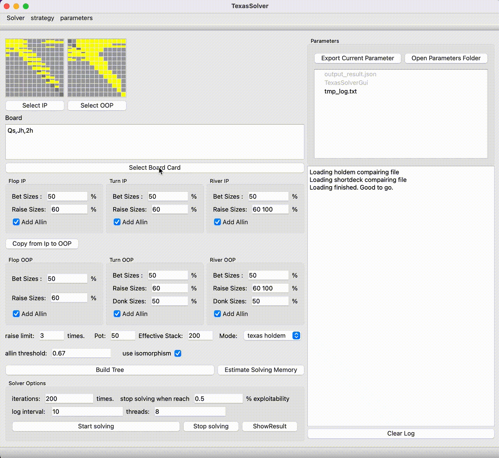

# 德州扑克/短牌 solver

README [English](README.md) | [中文](README.zh-CN.md)

## 项目介绍

一个开源的，极其高效的德州扑克和短牌solver, 看看这个 [介绍视频](https://www.bilibili.com/video/BV1sr4y1C7KE) 了解更多。支持Windows，MacOs和Linux。

Features:
- 对于1~2bet+allin的游戏树求解速度超过piosolver 
- 支持 Mac, Linux and Windows平台
- 支持德州扑克和短牌
- 支持跨语言调用，支持console调用
- 结果和piosolver对齐
- 支持将最优策略保存为json文件
- 是 [TexasHoldemSolverJava](https://github.com/bupticybee/TexasHoldemSolverJava) 的c++版本,速度是前者的5倍以上，而内存使用仅有前者的1/3不到

你可以通过 [google colab demo](https://colab.research.google.com/github/bupticybee/TexasSolver/blob/console/TexasSolverTechDemo.ipynb) 体验这个solver。

## 安装

根据你的操作系统型号从  [release package](https://github.com/bupticybee/TexasSolver/releases) 下载相应的包, 解压缩, 安装就完成了。就是这么简单。

## 图形界面版本使用

在安装solver之后，双击应用的图标 (在windows下，双击TexasSolverGui.exe；在mac下，双击 TexasSolverGui.app) 来运行TexasSolver。

## 命令行版本使用

请查看 [命令行版本文档](https://github.com/bupticybee/TexasSolver/tree/console#usage) 获取更多信息.

## 和piosolver的速度对比

两者均在一个spr=10的flop局面上进行计算，结果对齐。

|                   | 输入配置                                            | 运行日志                                                       | 线程数 | 内存 | 结束精度 | 运行时间 |
| ----------------- | ------------------------------------------------------- | ------------------------------------------------------------------ | ------ | ------ | -------- | -------- |
| piosolver 1.0     | [config_piosolver](benchmark/benchmark_piosolver.txt)   | [log_piosolver](benchmark/benchmark_outputs/piosolver_log.txt)     | 6      | 492Mb  | 0.29%    | 242s     |
| TexasSolver 0.1.0 (Our solver) | [config_texassolver](benchmark/benchmark_texassolver.txt) | [log_texassolver](benchmark/benchmark_outputs/texassolver_log.txt) | 6      | 1600Mb | 0.275%   | 175s     |

对齐结果的图片见 [result_compair](benchmark/benchmark_outputs/result_compair.png). 如你所见，两者的结果非常接近。

# License

[GNU AGPL v3](https://www.gnu.org/licenses/agpl-3.0.en.html)

# Email

icybee@yeah.net

# 常见问题

1. 问: 这个Solver真的是完全免费的么?
   - 答: 是的, 对于个人用户来说，这个solver是完全开源并且免费的。

2. 问: 我可以把这个Solver上传到其他网站/微信qq群或者分享給我的朋友么？
   - A: 不可以，你只能将项目的地址进行分享，不能直接分享项目的二进制文件。这个项目的License是 AGPL-V3, 直接分享/上传软件二进制文件直接违反了开源协议。

3. 问: 我可以将这个solver整合进我自己的商用软件么?
   - A: 如果你只是将软件的二进制文件整合进你的软件，那么可以，但是你仍然不可以分发TexasSolver的二进制文件。如果你想要将TexasSolver的源码整合进你的商用软件中，或者你的软件对外提供基于互联网的服务，那么你需要联系我付费取得一张商用License，这也是这个项目主要的盈利方式。

4. 问: 你撰写TexasSolver使用了什么框架？
   - A: 我使用了 QT 5.1.0 (开源版本) 构建了图形界面版本. 对于命令行版本，我试用了 Mingw + CMake.
